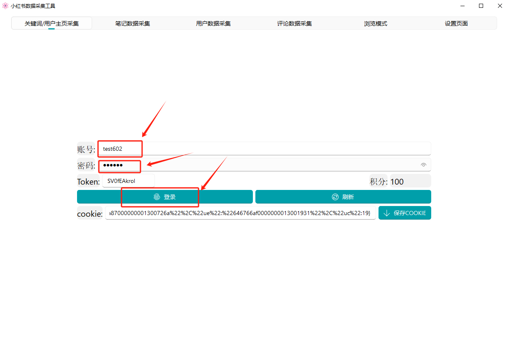
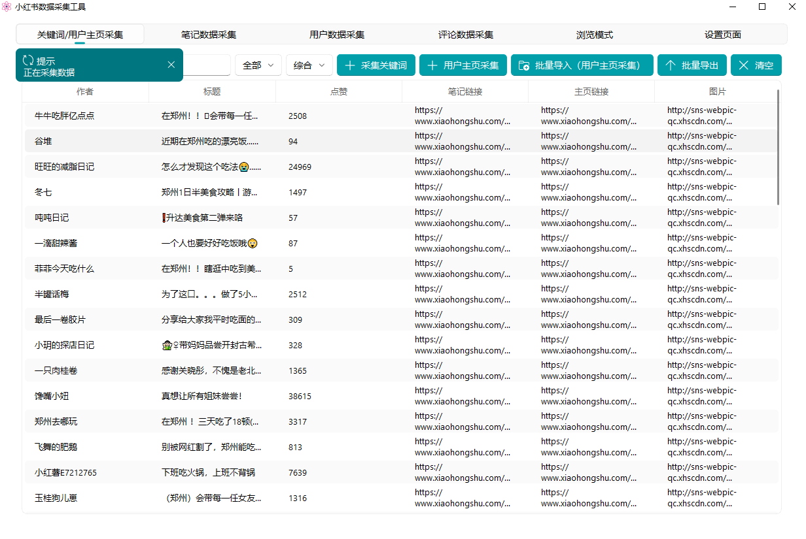
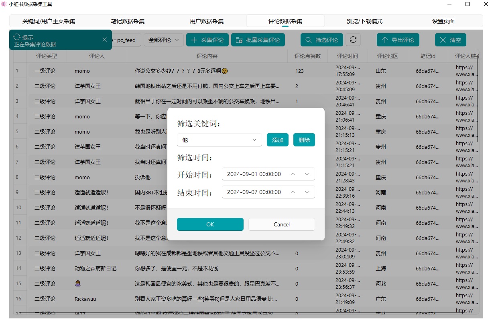
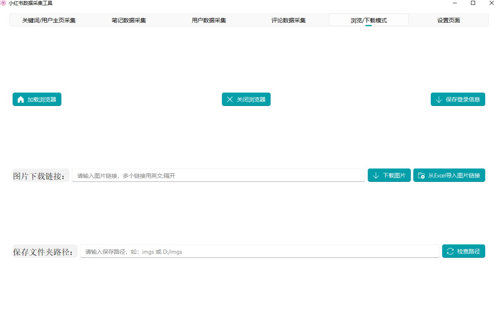

# 小红书笔记采集工具

#### 介绍
作者：skurua
能够采集小红书，笔记，搜索，用户主页等信息。

#### 软件架构
pyqt5 python httpx

#### 安装教程

1.解压
2.双击小红书数据采集

3.登录账号

#### 使用说明

批量采用用户数据需要导入主页链接

评论采集&筛选

图片下载

批量采集笔记数据选哟导入笔记链接
 **excel第一行需带 主页链接 或 笔记链接 的数据标题** 

#### 测试账号
| 测试账号 | 密码 |
|-----------|--------|
| test031   | 123456 |
| test032   | 123456 |
| test040   | 123456 |
| test060   | 123456 |
| test069   | 123456 |
| test070   | 123456 |
| test090   | 123456 |
| test113   | 123456 |
| test115   | 123456 |
| test127   | 123456 |
| test172   | 123456 |

